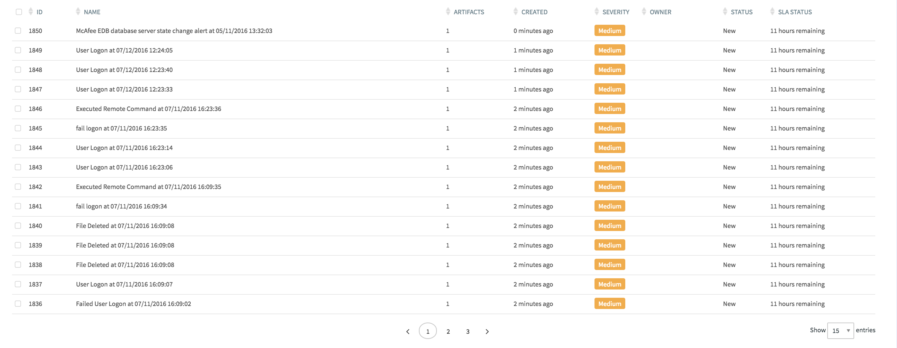
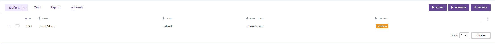
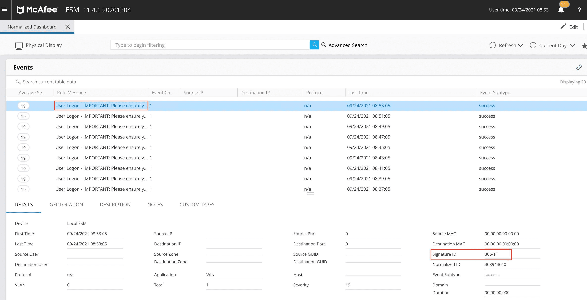
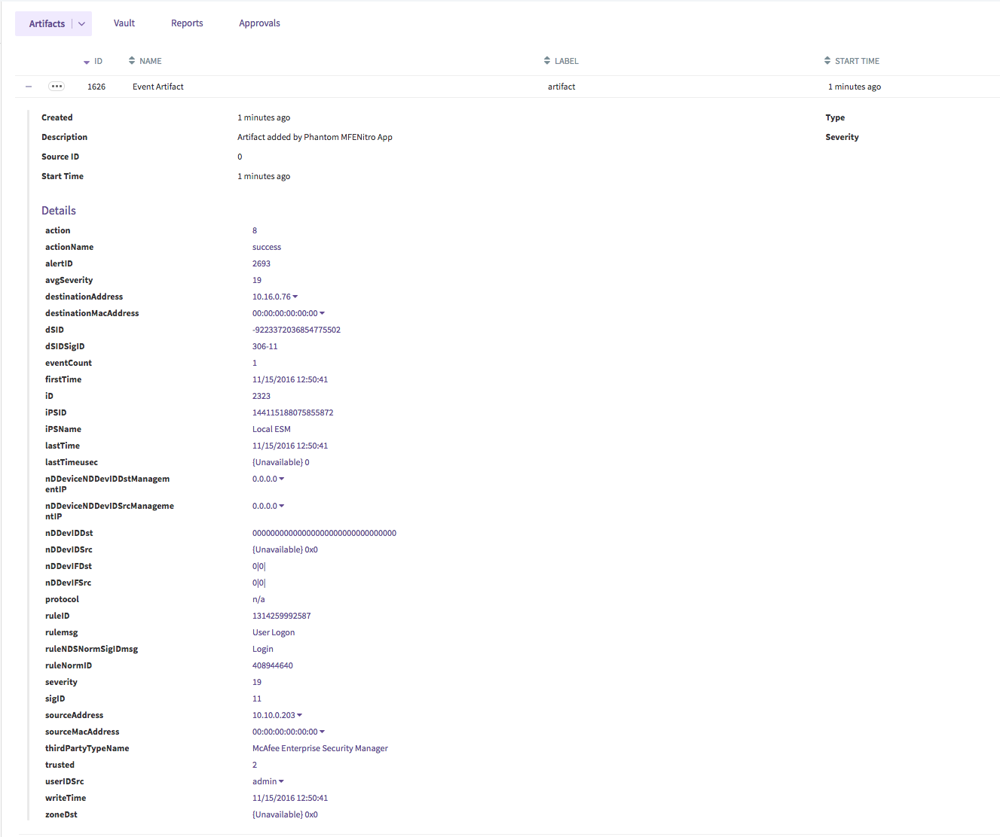

[comment]: # "Auto-generated SOAR connector documentation"
# McAfee ESM

Publisher: Phantom  
Connector Version: 2\.0\.6  
Product Vendor: McAfee  
Product Name: McAfee ESM  
Product Version Supported (regex): "\.\*"  
Minimum Product Version: 3\.5\.210  

This app integrates with an instance of McAfee ESM to perform investigative and ingestion actions

[comment]: # "File: readme.md"
[comment]: # "Copyright (c) 2016-2018 Splunk Inc."
[comment]: # ""
[comment]: # "Licensed under the Apache License, Version 2.0 (the 'License');"
[comment]: # "you may not use this file except in compliance with the License."
[comment]: # "You may obtain a copy of the License at"
[comment]: # ""
[comment]: # "    http://www.apache.org/licenses/LICENSE-2.0"
[comment]: # ""
[comment]: # "Unless required by applicable law or agreed to in writing, software distributed under"
[comment]: # "the License is distributed on an 'AS IS' BASIS, WITHOUT WARRANTIES OR CONDITIONS OF ANY KIND,"
[comment]: # "either express or implied. See the License for the specific language governing permissions"
[comment]: # "and limitations under the License."
[comment]: # ""
McAfee ESM identifies, correlates, and remediates information security threat events. The McAfee ESM
app enables the collection of these events and the corresponding event related information into
containers and artifacts in Phantom.

NOTE: This app deprecates an older app named "McAfee Nitro". Please delete the older app if
installed on Phantom and re-create the asset.

The first thing to do is create the McAfee ESM asset in Phantom and fill up the Device URL, the
Username and the Password. The other values can be left in the default state for now.  
However it's good practice to set the "Label of the objects from this source" to a **NEW ENTRY** . A
recommended label would be **ESM Event** or **ESM Alarm** .

  

Once the asset is saved, run Test Connectivity and make sure it passes. The Test Connectivity action
attempts to validate the Username and the Password that the user has provided by connecting to the
configured Device URL. The connection is tested by creating a session for the Username and Password
pair, the session will be established upon the authentication of the credentials. Then the action
also executes a query using the created session. And finally the created session is closed.  

The Test Connectivity action is successful only when the session is created and the REST API call is
made successfully.

  
Now that the config is out of the way, let's delve into the two modes that ingestion can occur and
the differences between them. One thing to note is that this app can be configured to ingest events
or alarms from ESM. For each object that is ingested, a single container containing an Event or
Alarm artifact is created.  
  
  
  
The container contains the raw data of the object that is acquired from the SIEM, and the key
details regarding the object are stored in the artifact of the container.  
  
  
  

## POLL NOW

POLL NOW should be used to get a sense of the containers and artifacts that are created by the app.
The POLL NOW dialog allows the user to set the "Maximum containers" that should be ingested at this
instance. Since a single container is created for each object, this value equates to the maximum
number of objects that are ingested by the app. The app will fetch objects in the order they were
created in the SIEM. The app allows the user to ingest objects up to 1 year old; this time interval
can be configured in minutes using the **poll_time** asset config (e.g. to ingest objects that have
been generated in the last 20 minutes, set this value to 20). However the query to ingest this data
can be quite time consuming. In some cases the query will timeout with an error message *Query not
completed in the configured time. Please increase the query_timeout value in the asset config and
try again.* If you run into this error, you will need to tune the **poll_time** and
**query_timeout** parameters to values that allow you to ingest enough data during POLL NOW within a
large enough timeout value.

## Scheduled Polling

This mode is used to schedule a polling action on the asset at regular intervals, which is
configured via the INGEST SETTINGS tab of the asset. It makes use of the following asset
configuration parameters (among others):

-   Maximum objects to poll first time

      
    The app detects the first time it is polling an asset and will ingest these number of objects
    (at the most). It will also use the **poll_time** value.

-   Maximum Containers for scheduled polling

      
    For all scheduled polls after the first, the app will ingest these number of objects (at the
    most).

In case of Scheduled Polling, on every poll, the app remembers the time of the last object that it
has ingested and will continue from the this time in the next polling cycle. For best results, keep
the poll interval and *Maximum Containers for scheduled polling* values close to the number of
objects you would get within a time interval. This way, every poll will end up ingesting all of the
new objects.  
It is also very important that the *Maximum Containers for scheduled polling* configured should be
greater than maximum objects that are generated **per second** . If the app detects it got the
maximum configured objects and all occurred in the same second, it will start polling from the next
second in the next polling cycle.

## Containers created

As mentioned before, the app will create a single container for each object that it ingests with a
single artifact called Event (or Alarm) Artifact.

### Filtering Events

Configure filters in the asset config **filters** field to limit the type and number of events that
get ingested into Phantom (only the matching events get ingested). The filter format is a json
string and defined by the McAfee ESM API. A simple e.g. could be:  
  

       [{
        "type": "EsmFieldFilter",
        "field": {"name": "Action"},
        "operator": "EQUALS",
        "values": [{
            "type": "EsmBasicValue",
            "value": "8"
        }]
       }]

The McAfee ESM installation has documentation on this format and can be found at:

-   https://\[mcafee_esm_ip\]/rs/esm/help/commands/qryExecuteDetail
-   https://\[mcafee_esm_ip\]/rs/esm/help/types/EsmFilter

Few things to note:

-   The input is a json string which has to be a list. The action validates this.
-   Not all event fields can be filtered on, to get the keys that can be used in a filter, look at
    the results of the **list fields** action.

A very common case is to filter on the event types. One way to accomplish this is to expand the
event details and note down the Signature ID of the event that you want to ingest into Phantom. For
example to ingest events named **User Logon** , note down the *Signature ID* . In the screen-shot
below this happens to be *306-11* .  
  
  
  
This value can then be used to match the key named **DSIDSigID** using the filter:  
  

       [{
        "type": "EsmFieldFilter",
        "field": {"name": "DSIDSigID"},
        "operator": "EQUALS",
        "values": [{
            "type": "EsmBasicValue",
            "value": "306-11"
        }]
       }]

NOTE: This asset configuration parameter only applies to events, and thus is ignored when ingesting
alarms.

## Event Artifact

The details regarding the event that are acquired from the API call to the McAfee SIEM will be
collected and the data that are related to the type of event are all stored into the CEF fields and
are added to the artifact. The fields that are present in the artifact greatly depend upon the type
of the event that was created. Different events will have different types of values in the
artifacts.  
  
  

### Configuration Variables
The below configuration variables are required for this Connector to operate.  These variables are specified when configuring a McAfee ESM asset in SOAR.

VARIABLE | REQUIRED | TYPE | DESCRIPTION
-------- | -------- | ---- | -----------
**base\_url** |  required  | string | Device URL, e\.g\. https\://myesm\.enterprise\.com
**verify\_server\_cert** |  required  | boolean | Verify server certificate
**username** |  required  | string | User name
**password** |  required  | password | Password
**version** |  optional  | string | Version
**ingest\_data** |  optional  | string | Type of data to ingest
**filters** |  optional  | string | List of filters \(JSON\)
**max\_containers** |  required  | numeric | Maximum objects for scheduled polling
**first\_run\_max\_events** |  required  | numeric | Maximum objects to poll first time
**poll\_time** |  optional  | numeric | Ingest objects in last N minutes \(POLL NOW and First Run\)
**query\_timeout** |  optional  | numeric | Max Time to wait for query to finish \(seconds\)
**timezone** |  required  | timezone | Timezone configured on device

### Supported Actions  
[test connectivity](#action-test-connectivity) - Validates the credentials  
[list fields](#action-list-fields) - List the fields available to be used in filters  
[on poll](#action-on-poll) - Ingest Events or Alarms from ESM  
[list watchlists](#action-list-watchlists) - List the watchlists configured in ESM  
[get events](#action-get-events) - Get the events associated with a correlated event ID  
[get watchlist](#action-get-watchlist) - Get the details for a specific watchlist and the values in that watchlist as configured in the ESM  
[update watchlist](#action-update-watchlist) - Add an entry to a specific watchlist as configured in the ESM  

## action: 'test connectivity'
Validates the credentials

Type: **test**  
Read only: **True**

#### Action Parameters
No parameters are required for this action

#### Action Output
No Output  

## action: 'list fields'
List the fields available to be used in filters

Type: **generic**  
Read only: **True**

#### Action Parameters
No parameters are required for this action

#### Action Output
DATA PATH | TYPE | CONTAINS
--------- | ---- | --------
action\_result\.data\.\*\.name | string | 
action\_result\.data\.\*\.types | string | 
action\_result\.status | string | 
action\_result\.message | string | 
action\_result\.summary\.total\_fields | numeric | 
summary\.total\_objects | numeric | 
summary\.total\_objects\_successful | numeric |   

## action: 'on poll'
Ingest Events or Alarms from ESM

Type: **ingest**  
Read only: **True**

#### Action Parameters
PARAMETER | REQUIRED | DESCRIPTION | TYPE | CONTAINS
--------- | -------- | ----------- | ---- | --------
**start\_time** |  optional  | Start of time range, in epoch time \(milliseconds\) | numeric | 
**end\_time** |  optional  | End of time range, in epoch time \(milliseconds\) | numeric | 
**container\_count** |  optional  | Maximum number of container records to query for | numeric | 
**artifact\_count** |  optional  | Maximum number of artifact records to query for | numeric | 

#### Action Output
No Output  

## action: 'list watchlists'
List the watchlists configured in ESM

Type: **investigate**  
Read only: **True**

#### Action Parameters
No parameters are required for this action

#### Action Output
DATA PATH | TYPE | CONTAINS
--------- | ---- | --------
action\_result\.data\.\*\.name | string | 
action\_result\.data\.\*\.customType\.name | string | 
action\_result\.data\.\*\.id\.value | numeric |  `esm watchlist id` 
action\_result\.data\.\*\.valueCount | numeric | 
action\_result\.data\.\*\.scored | string | 
action\_result\.data\.\*\.errorMsg | string | 
action\_result\.data\.\*\.dynamic | string | 
action\_result\.data\.\*\.source | string | 
action\_result\.data\.\*\.active | string | 
action\_result\.data\.\*\.type\.name | string | 
action\_result\.status | string | 
action\_result\.message | string | 
action\_result\.summary\.total\_fields | numeric | 
summary\.total\_objects | numeric | 
summary\.total\_objects\_successful | numeric |   

## action: 'get events'
Get the events associated with a correlated event ID

Type: **investigate**  
Read only: **True**

#### Action Parameters
PARAMETER | REQUIRED | DESCRIPTION | TYPE | CONTAINS
--------- | -------- | ----------- | ---- | --------
**event\_id** |  required  | Event ID in the McAfee ESM | numeric |  `esm event id` 
**field\_list** |  optional  | Comma separated list of event fields to get | string | 

#### Action Output
DATA PATH | TYPE | CONTAINS
--------- | ---- | --------
action\_result\.status | string | 
action\_result\.parameter\.field\_list | string | 
action\_result\.parameter\.event\_id | string |  `esm event id` 
action\_result\.data\.\*\.Rule\_msg | string | 
action\_result\.data\.\*\.DSIDSigID | string | 
action\_result\.data\.\*\.SrcIP | string | 
action\_result\.data\.\*\.DstIP | string | 
action\_result\.data\.\*\.LastTime | string | 
action\_result\.message | string | 
action\_result\.summary\.total\_values | numeric | 
summary\.total\_objects | numeric | 
summary\.total\_objects\_successful | numeric |   

## action: 'get watchlist'
Get the details for a specific watchlist and the values in that watchlist as configured in the ESM

Type: **investigate**  
Read only: **True**

#### Action Parameters
PARAMETER | REQUIRED | DESCRIPTION | TYPE | CONTAINS
--------- | -------- | ----------- | ---- | --------
**watchlist\_id** |  required  | Watchlist ID in the McAfee ESM | numeric |  `esm watchlist id` 

#### Action Output
DATA PATH | TYPE | CONTAINS
--------- | ---- | --------
action\_result\.parameter\.watchlist\_id | string |  `esm watchlist id` 
action\_result\.summary\.name | string | 
action\_result\.summary\.type | string | 
action\_result\.data\.\*\.values | string | 
action\_result\.status | string | 
action\_result\.message | string | 
action\_result\.summary\.total\_values | numeric | 
summary\.total\_objects | numeric | 
summary\.total\_objects\_successful | numeric |   

## action: 'update watchlist'
Add an entry to a specific watchlist as configured in the ESM

Type: **correct**  
Read only: **False**

#### Action Parameters
PARAMETER | REQUIRED | DESCRIPTION | TYPE | CONTAINS
--------- | -------- | ----------- | ---- | --------
**watchlist\_id** |  required  | Watchlist ID in the McAfee ESM | numeric |  `esm watchlist id` 
**values\_to\_add** |  required  | Comma separated list of values to add to the watchlist\. \(e\.g\. '10\.10\.10\.10, 192\.168\.1\.4, 172\.16\.32\.32'\) | string | 

#### Action Output
DATA PATH | TYPE | CONTAINS
--------- | ---- | --------
action\_result\.parameter\.values\_to\_add | string | 
action\_result\.parameter\.watchlist\_id | string |  `esm watchlist id` 
action\_result\.summary\.name | string | 
action\_result\.summary\.type | string | 
action\_result\.data\.\*\.values | string | 
action\_result\.status | string | 
action\_result\.message | string | 
action\_result\.summary\.total\_values | numeric | 
summary\.total\_objects | numeric | 
summary\.total\_objects\_successful | numeric | 